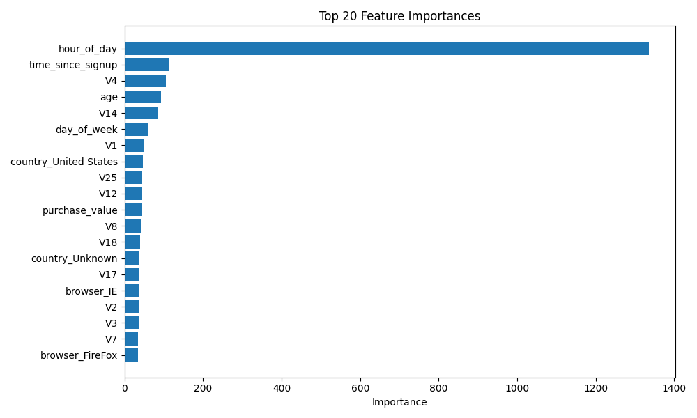
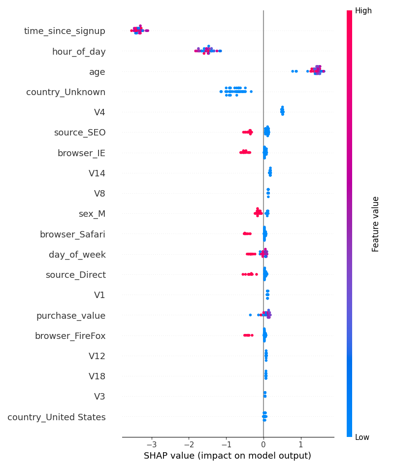

# Final Report - Credit Card Fraud Detection Using Machine Learning

##  Project Overview

The objective of this project is to detect fraudulent credit card transactions using supervised machine learning techniques. Fraudulent transactions are rare and often exhibit distinct patterns, making the dataset highly imbalanced. Accurate fraud detection is critical to minimizing financial losses and increasing trust in digital financial systems.

I used multiple models and selected **LightGBM** as my final model based on a balance between precision and recall, model interpretability, and speed.

---

## 📌 Model Selection

I trained the following models:

- Logistic Regression
- Decision Tree
- Random Forest
- XGBoost
- LightGBM  *(Selected)*

After evaluating on key metrics, **LightGBM** was chosen for its high AUC, good F1 Score, and advanced interpretability tools.

---

## Evaluation Metrics (LightGBM)

| Metric       | Score   |
|--------------|---------|
| Accuracy     | 0.9784  |
| Precision    | 0.7343  |
| Recall       | 0.5614  |
| F1 Score     | 0.6363  |
| ROC AUC      | 0.9249  |

> **Why LightGBM?**  
> - Strong handling of imbalanced datasets  
> - High performance and fast training  
> - Built-in feature importance  
> - Compatible with SHAP for explainability

---

##  Explainability Highlights

### 🔹 Global Feature Importance

> The most important features identified by LightGBM include `hour_of_day`, `time_since_signup`, and `V4`, which significantly impact classification decisions.

---

### 🔸 SHAP Summary Plot

> SHAP values offer a consistent view of how each feature contributes to predictions across the test dataset.

---

### 🔸 Local Explanation (Instance-Level)

> For a specific transaction, the SHAP waterfall plot clearly shows how features push the model’s decision towards fraud or non-fraud.

---

## 🔁 Future Improvements

- Try ensemble models or stacking techniques
- Handle class imbalance using SMOTE or other oversampling methods
- Build a real-time fraud detection API
- Integrate feedback loops for model retraining

---

## By

- **Abel Adamu Shumet**  

---

## 🏁 Conclusion

This project demonstrates the ability of modern machine learning methods like LightGBM to tackle real-world fraud detection problems. Combining performance with transparency, this approach provides both accuracy and accountability, aligning with financial sector needs.

